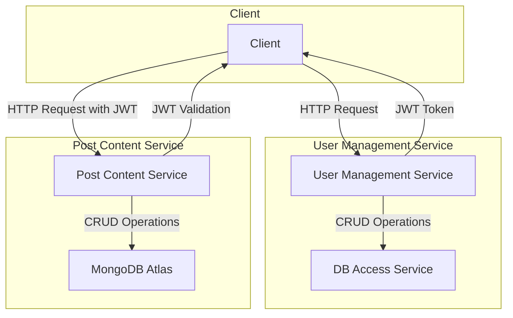
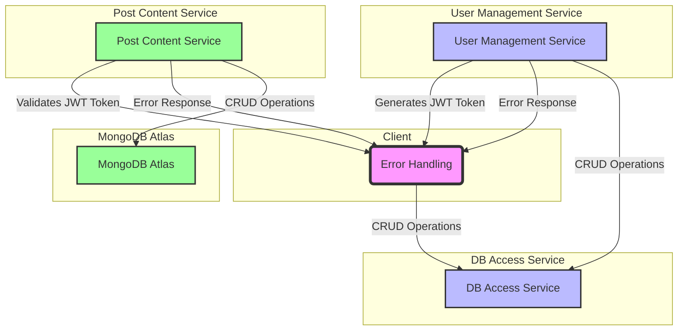
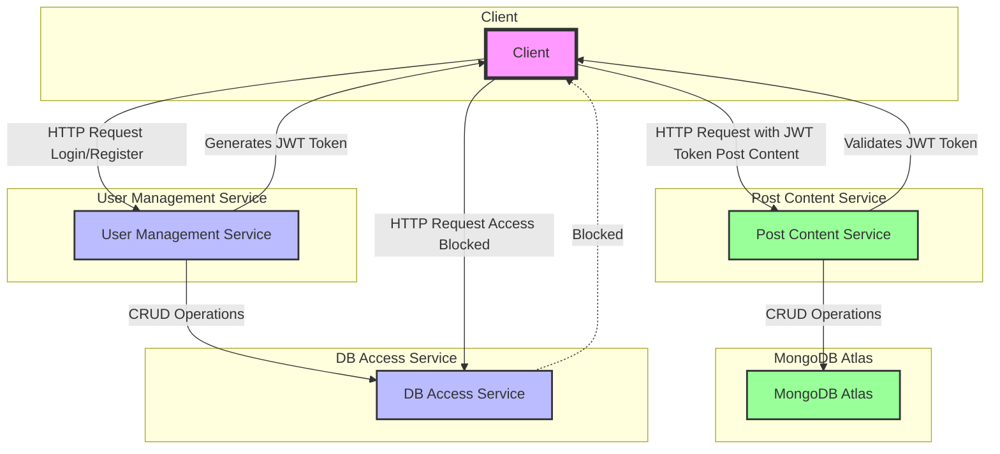

```mermaid
graph TD;
    subgraph "Client"
        A[Client]
    end
    subgraph "User Management Service"
        B[User Management Service]
        B -->|CRUD Operations| C[DB Access Service]
        B -->|JWT Token| A
    end
    subgraph "Post Content Service"
        D[Post Content Service]
        D -->|JWT Validation| A
        D -->|CRUD Operations| E[MongoDB Atlas]
    end
    
    A -->|HTTP Request| B;
    A -->|HTTP Request with JWT| D;
    
%%    style A fill:#f9f,stroke:#333,stroke-width:4px;
%%    style B fill:#bbf,stroke:#333,stroke-width:2px;
%%    style C fill:#bbf,stroke:#333,stroke-width:2px;
%%    style D fill:#9f9,stroke:#333,stroke-width:2px;
%%    style E fill:#9f9,stroke:#333,stroke-width:2px;
```

```mermaid

graph TD;
    subgraph "Client"
        A[Client]
    end
    subgraph "User Management Service"
        B[User Management Service]
        B -->|Generates JWT Token| A
        B -->|Error Response| A(Error Handling)
    end
    subgraph "DB Access Service"
        C[DB Access Service]
    end
    subgraph "Post Content Service"
        D[Post Content Service]
        D -->|Validates JWT Token| A
        D -->|Error Response| A(Error Handling)
    end
    subgraph "MongoDB Atlas"
        E[MongoDB Atlas]
    end
    
    A -->|CRUD Operations| C;
    B -->|CRUD Operations| C;
    D -->|CRUD Operations| E;
    
    style A fill:#f9f,stroke:#333,stroke-width:4px;
    style B fill:#bbf,stroke:#333,stroke-width:2px;
    style C fill:#bbf,stroke:#333,stroke-width:2px;
    style D fill:#9f9,stroke:#333,stroke-width:2px;
    style E fill:#9f9,stroke:#333,stroke-width:2px;
    
```

```mermaid

graph TD;
    subgraph "Client"
        A[Client]
    end
        subgraph "MongoDB Atlas"
        E[MongoDB Atlas]
    end
        subgraph "DB Access Service"
        C[DB Access Service]
        C -.-> |Blocked| A
    end
    subgraph "User Management Service"
        B[User Management Service]
        B -->|Generates JWT Token| A
        B -->|CRUD Operations| C[DB Access Service]
    end

    subgraph "Post Content Service"
        D[Post Content Service]
        D -->|Validates JWT Token| A
        D -->|CRUD Operations| E[MongoDB Atlas]
    end

    
    A -->|HTTP Request Login/Register| B;
    A -->|HTTP Request with JWT Token Post Content| D;
    A -->|HTTP Request Access Blocked| C;
    
    style A fill:#f9f,stroke:#333,stroke-width:4px;
    style B fill:#bbf,stroke:#333,stroke-width:2px;
    style C fill:#bbf,stroke:#333,stroke-width:2px;
    style D fill:#9f9,stroke:#333,stroke-width:2px;
    style E fill:#9f9,stroke:#333,stroke-width:2px;

```